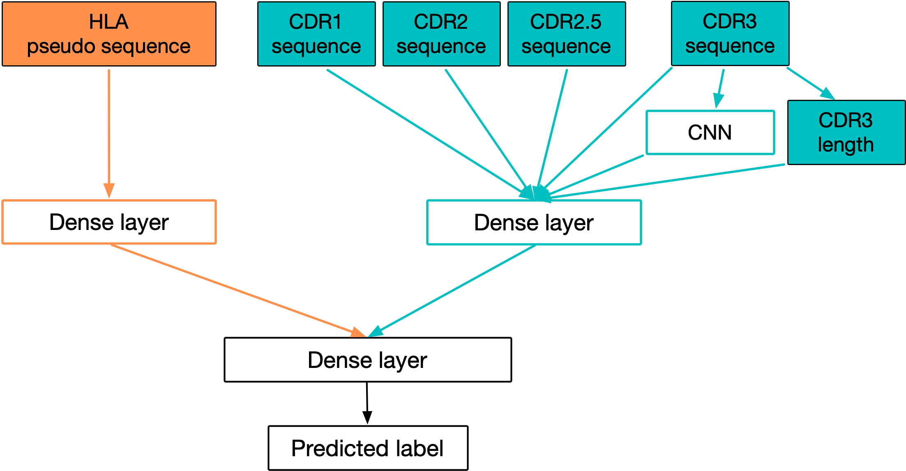

## DePTH Tutorial

**DePTH 1.0 Authors:** Si Liu (sliu3@fredhutch.org), Philip Bradley (pbradley@fredhutch.org), Wei Sun (wsun@fredhutch.org), Fred Hutchinson Cancer Center

**DePTH 2.0 Authors:** Fumin Li (lifm6@uw.edu), University of Washington, Si Liu (sliu3@fredhutch.org), Wei Sun (wsun@fredhutch.org), Fred Hutchinson Cancer Center

**Maintainer:** Si Liu (sliu3@fredhutch.org)

**Latest revision:** 01/13/2025

## Introduction

A T cell relies on its T cell receptor (TCR) to recognize foreign antigens
presented by a human leukocyte antigen (HLA), which is the human version of
major histocompatibility complex (MHC). Knowing the association between TCR and
HLA can be helpful for inferring past infection, studying T cell-related
treatments for certain diseases. We develop DePTH, a Python package that provides
neural network models to predict the association of given TCR and HLA based on
their amino acid sequences.

{:refdef: style="text-align: center;"}

{: refdef}

The figure above shows the structure of DePTH model. The HLA is translated into
its pseudo sequence (the sequence of amino acids on certain important positions).
The TCR comes in the format of beta chain V gene and CDR3, and the V gene is
translated into CDR1, CDR2, and CDR2.5 amino acid sequences. There are two separate
dense layers, one for HLA and one for TCR. The outputs of these two layers are
concatenated together and passed through one or two dense layers before getting to
the final prediction.

The direct output given by our models is a score between 0 and 1, with a higher
score corresponding to higher predicted chance of association.

## Installation

Start a [conda](https://www.anaconda.com) virtual environment (DePTH requires python>=3.9):
```js
conda create -n DePTH_env python=3.9
```
Activate the conda environment:
```js
conda activate DePTH_env
```
Install DePTH package in the activated conda environment:
```js
python -m pip install DePTH
```
Once the installation is finished, can try the following command:
```js
DePTH -h
```
The following console output should show up:
```js
usage: DePTH [-h] {train,predict,cv} ...

DePTH: a neural network model for sequence-based TCR and HLA association prediction

positional arguments:
  {train,predict,cv}  whether to train or predict
    train             train a DePTH model
    predict           load a trained DePTH model to make prediction
    cv                cross-validation for a specific hyperparameter setting

optional arguments:
  -h, --help          show this help message and exit
```
Running the command lines below will show more information on the input arguments
for each option. The information will be explained in more details in sections below.
```js
DePTH predict -h
DePTH train -h
DePTH cv -h
```
## Get prediction from DePTH 2.0 default models

DePTH default models were updated to DePTH 2.0 on Dec. 27, 2024. The updated
default models were trained on data sets richer than those used for DePTH 1.0.
DePTH 1.0 default models are kept as legacy and can be called by command lines
specified at the end of this tutorial.

By default, DePTH provides two sets of models, one for TCR-HLA pairs involving
HLA-I alleles, and one for those involving HLA-II alleles, respectively. Each
set contains 20 model trained on different sets of random seeds. For each
TCR-HLA pair in test file, the prediction score is the average of scores given
by 20 models.

The required input are:

*   test_file, csv file of test TCR-HLA pairs. The format requirement is listed
below.

*   hla_class, HLA_I or HLA_II. All HLAs in one test file must all belong to one
 HLA class.

*   output_dir, the directory supposed to hold the file of output.
If not specified, current directory will be used. If specified, should not
include ".." as part of the path. If the specified path does not exist,
the path will be created in the process of running DePTH command lines.

#### Format requirement on file of test pairs:
*   It needs to be a csv file with columns names following the format of
[example test file](https://github.com/Sun-lab/DePTH_pipeline/blob/main/data/HLA_I_all_match/test/test_pos.csv).

*   For TCRs, the V gene needs to follow the format of those in
[V gene file](https://github.com/Sun-lab/DePTH_pipeline/blob/main/data/for_encoders/combo_xcr.tsv)
after subsetting the data inside the file by organism == 'human', chain == 'B' and region == 'V'.
For a TCR with a V gene that cannot be found in this file after having its format converted, the part of string corresponding
to V gene needs to be replaced with string "not_found".

*   For TCRs, the length of CDR3 amino acid sequence needs to be not longer
than 27, and the CDR3 sequence should not contain any character other than
the 20 amino acids and ".".

*   All HLAs in one test file must belong to one HLA class, either HLA-I or HLA-II.

*   For HLA-I alleles, they need to be one of the 85 HLA-I alleles in
[this file](https://github.com/Sun-lab/DePTH_pipeline/blob/main/data/for_encoders/HLA_I_pseudo_40.csv).
For HLA-II alleles, they need to be one of the 250 HLA-II alleles in
[this file](https://github.com/Sun-lab/DePTH_pipeline/blob/main/data/for_encoders/HLA_II_pseudo_45.csv).

Example command line for HLA_I:
```js
DePTH predict --test_file test_HLA_I_pairs.csv \
              --hla_class HLA_I \
              --output_dir test_HLA_I_output
```

Example command line for HLA_II:
```js
DePTH predict --test_file test_HLA_II_pairs.csv \
              --hla_class HLA_II \
              --output_dir test_HLA_II_output
```

The output file named "predicted_scores.csv" will be created in the folder
specified for output_dir. This file follows the format of the file of test
pairs, with an additional column providing the prediction scores.

For example, in the case of HLA_I, if the file of test pairs is
[this one](https://github.com/Sun-lab/DePTH_pipeline/blob/main/data/HLA_I_all_match/test/test_pos.csv),
the first few lines of this file is:
```js
tcr,hla_allele
"TRBV9*01,CASSEGQKETQYF",HLA-A*03:01
"TRBV5-1*01,CASSLVGVTDTQYF",HLA-B*07:02
"TRBV27*01,CASSSGTSGNNEQFF",HLA-B*27:05
"TRBV7-9*01,CASSLGSSYEQYF",HLA-A*24:02
"TRBV5-1*01,CASSLATEGDTQYF",HLA-B*08:01
"TRBV5-8*01,CASSLGRENSPLHF",HLA-B*08:01
```
The first few lines of the output file test_HLA_I_output/predicted_scores.csv
will be:
```js
tcr,hla_allele,score
"TRBV9*01,CASSEGQKETQYF",HLA-A*03:01,0.27827388704754413
"TRBV5-1*01,CASSLVGVTDTQYF",HLA-B*07:02,0.1244928405387327
"TRBV27*01,CASSSGTSGNNEQFF",HLA-B*27:05,0.9632433295249939
"TRBV7-9*01,CASSLGSSYEQYF",HLA-A*24:02,0.0391123797075124
"TRBV5-1*01,CASSLATEGDTQYF",HLA-B*08:01,0.3890836928039789
"TRBV5-8*01,CASSLGRENSPLHF",HLA-B*08:01,0.2891890250146389
```


## Train new models
Alternatively, user can also train new models based on the training and
validation data files in [this folder for HLA-I ](https://github.com/Sun-lab/DePTH_pipeline/tree/main/data/HLA_I_all_match/train_valid) and [this folder for HLA-II](https://github.com/Sun-lab/DePTH_pipeline/tree/main/data/HLA_II_all_match/train_valid), or new data files.

The required inputs are:

*   hla_class, must be either HLA_I or HLA_II.

*   data_dir, the path to the folder where training and validation data files
are located. The TCR-HLA pairs must be put into four separate csv files with
filenames "train_pos.csv", "train_neg.csv", "valid_pos.csv" and "valid_neg.csv"
for positive training pairs, negative training pairs, positive validation pairs
and negative validation pairs, respectively, like the organization of example
files shown in [this folder](https://github.com/Sun-lab/DePTH_pipeline/tree/main/data/HLA_I_all_match/train_valid).

*   model_dir, the path to the folder to hold the trained models. Should not
include ".." as part of the path. If the specified path does not exist, it will
be created in the process of running DePTH command lines.

DePTH allows hyperparameters in multiple aspects:

*   enc_method, encoding method for amino acid, can be one of one_hot, blosum62,
 atchley, and pca. Default is one_hot.

*   lr, learning rate. Default is 0.0001.

*   n_dense, number of dense layers after concatenating the separate TCR and HLA
 parts together. Can be either 1 or 2. Default is 2.

*   n_units_str, a list of sizes of the dense layers, must be in the format of a
 list with length matching n_dense (with only ",", no space between numbers in
 the list if the list has length 2). Default is [64,16].

*   dropout_flag, whether to use dropout or not, can be either True or False.
Default is True.

*   p_dropout, dropout probability. Default is 0.2.

DePTH sets three random seeds for training:

*   rseed, random seed for random module. Default is 1000.

*   np_seed, random seed for numpy. Default is 1216.

*   tf_seed, random seed for tensorflow. Default is 2207.


Example command line for training a new model (HLA-I):
```js
DePTH train --hla_class HLA_I \
            --data_dir data/HLA_I_all_match/train_valid \
            --model_dir saved_models/HLA_I/HLA_I_model_5779_7821_6367 \
            --enc_method one_hot \
            --lr 0.0001 \
            --n_dense 2 \
            --n_units_str [64,16] \
            --dropout_flag True \
            --p_dropout 0.2 \
            --rseed 5779 \
            --np_seed 7821 \
            --tf_seed 6367
```
**Possible issue with Mac and solutions:**

When running the command lines above on Mac, Mac may show error message:
```js
zsh: no matches found: [64,16]
```
There are two solutions, one is to put "\\" before each of the brackets
in the value specified for n_units_str:
```js
DePTH train --hla_class HLA_I \
            --data_dir data/HLA_I_all_match/train_valid \
            --model_dir saved_models/HLA_I/HLA_I_model_5779_7821_6367 \
            --enc_method one_hot \
            --lr 0.0001 \
            --n_dense 2 \
            --n_units_str \[64,16\] \
            --dropout_flag True \
            --p_dropout 0.2 \
            --rseed 5779 \
            --np_seed 7821 \
            --tf_seed 6367
```
The other one is to put the command lines in a .sh file, for example,
named train_HLA_I.sh, with the following content:
```js
#!/bin/bash

DePTH train --hla_class HLA_I \
            --data_dir data/HLA_I_all_match/train_valid \
            --model_dir saved_models/HLA_I/HLA_I_model_5779_7821_6367 \
            --enc_method one_hot \
            --lr 0.0001 \
            --n_dense 2 \
            --n_units_str [64,16] \
            --dropout_flag True \
            --p_dropout 0.2 \
            --rseed 5779 \
            --np_seed 7821 \
            --tf_seed 6367
```
and then do:
```js
chmod +x train_HLA_I.sh
./train_HLA_I.sh
```

## Cross-validation
To help with choosing hyperparameter setting, DePTH offers an option of doing
5-fold cross-validation under given hyperparameters.

In each fold, the training and validation TCR-HLA pairs are combined together
and randomly split again, such that the number of new training positive pairs
equals that of the original training positive pairs, and the number of new
training positive pairs equals that of the original training negative pairs.
Each fold has a validation AUC, and the final output of cross-validation is
the average of five validation AUCs from five folds.

The required inputs are:

*   hla_class, must be either HLA_I or HLA_II.

*   data_dir, the path to the folder where training and validation data files
are located. File format and organization requirements are the same as those
for training a new model.

*   average_valid_dir, the path to the folder to hold the file of average
validation AUC. Should not include ".." as part of the path. If the specified
path does not exist, it will be created in the process of running DePTH command
lines.

The usage of hyperparameter options are the same as those listed for training
a new model.

Example command line for cross-validation under certain hyperparameters for HLA-I:
```js
DePTH cv --hla_class HLA_I \
         --data_dir data/HLA_I_all_match/train_valid \
         --average_valid_dir cv_average_valid/HLA_I/one_hot_5779_7821_6367 \
         --enc_method one_hot  \
         --lr 0.0001 \
         --n_dense 2 \
         --n_units_str [64,16] \
         --dropout_flag True \
         --p_dropout 0.2 \
         --rseed 5779 \
         --np_seed 7821 \
         --tf_seed 6367
```
The ways to solve the issue of potential error message
```js
zsh: no matches found: [64,16]
```
from Mac are the same as those in the case of training a new model.

The output will be a csv file average_validation_auc_roc.csv under the specified
directory for average_valid_dir, and the content format will be similar to this one below:
```js
average_valid_auc
0.7897524952888488
```
The exact value may change across different platforms and different tensorflow
versions.

## Get prediction from a new model

Once a model is trained, it can be loaded to make prediction on test data.

The required inputs are:

*   test_file, csv file of test TCR-HLA pairs. The format requirements are the
same as those listed in the part of getting predictions from default models.

*   hla_class, either HLA_I or HLA_II. Must be the same with that used for
training the model and that in the test pairs.

*   output_dir, the directory supposed to hold the file of output.
If not specified, current directory will be used. If specified,
should not include ".." as part of the path. If the specified path does not exist,
the path will be created in the process of running DePTH command lines.

*   default_model, whether to use default models or not. If want to use
new model, must set it to False.

*   model_dir, the path to the folder to hold the trained models.

*   enc_method, the encoding method for amino acid sequences. Must be the same
as that used for training the new model.

Example command line for getting prediction scores from a new model (HLA-I):

```js
DePTH predict --test_file test_HLA_I_pairs.csv \
              --hla_class HLA_I \
              --output_dir results/HLA_I/HLA_I_5779_7821_6367 \
              --default_model False \
              --model_dir saved_models/HLA_I/HLA_I_model_5779_7821_6367 \
              --enc_method one_hot
```
The output file of prediction scores will follow the same format as
in the case of getting prediction from default models, except that the scores
will be based on one single model instead.

## Get prediction from legacy DePTH 1.0 default models

DePTH 1.0 default models are kept as legacy.  They can be loaded to make predictions
by additionally specifying the option:
```js
--default_model legacy
```
under the same file format requirements as illustrated
for the case of using DePTH 2.0 default models to make predictions. The full example
command lines are as shown below:

Example command line for HLA_I:
```js
DePTH predict --test_file test_HLA_I_pairs.csv \
              --hla_class HLA_I \
              --default_model legacy \
              --output_dir test_HLA_I_output
```

Example command line for HLA_II:
```js
DePTH predict --test_file test_HLA_II_pairs.csv \
              --hla_class HLA_II \
              --default_model legacy \
              --output_dir test_HLA_II_output
```
